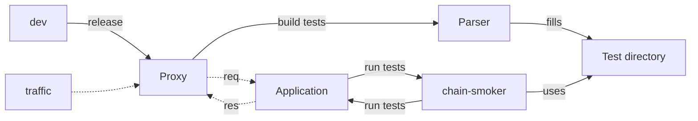
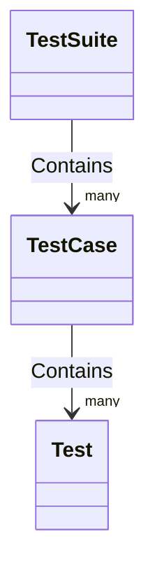

# chain-smoker
An easy-to-use testing framework for web interfaces.

## Quick example:
```yaml
type: 'api-test'
config:
  client:
    base_url: 'https://example.com'
tests:
  test_something:
    status_code: 200
    contains:
      This domain is for use in illustrative examples in documents.
      You may use this domain in literature without prior coordination or asking for permission.
```
or look into `examples/`
```shell
./chain-smoker.py -d examples
```

## Introduction
It's an issue for me, my friends and my colleagues at work or university.
We write code we test initially, but over time we forget about specific business logic
or functionality that lies in our API endpoints.
For this I started to build `chain-smoker`, a testing tool, with a functionality similar to https://uptimerobot.com.
You build your API, set up the tests, publish it and get notified whenever something breaks.

## Features
**`chain-smoker`** is the main application, a test suite runner. It gets shipped with a
**test case parser**, which includes a reverse proxy to collect incoming request and outgoing response pairs
to create test cases which can be used by `chain-smoker`.

But how to use it and how to automate the tests?

## Using `chain-smoker`

First, clone the repository
```shell
git clone git@https://github.com/philsupertramp/chain-smoker.git
```
Now, you can decide to either use the provided `Dockerfile` and use the tool using `docker`, or you use the raw Python implementation.

### Python
Set up a local virtual environment
```shell
virtualenv .venv
source .venv/bin/activate

pip install --upgrade pip
pip install -r requirements.txt
```
To verify your set-up is working correctly, run
```shell
> bar=baz ./chain-smoker/chain-smoker.py -d examples
[2022-09-14 13:37:32,554] INFO - Running for examples/complex-yaml.yaml:
[2022-09-14 13:37:38,292] INFO - Success for test_something!
[2022-09-14 13:37:38,302] INFO - Running for examples/multi_step_example.yaml:
[2022-09-14 13:37:38,302] INFO - Running chained test case reuse_authentication_header_in_following_request:
[2022-09-14 13:37:38,951] INFO - Success for get-with-header!
[2022-09-14 13:37:39,069] INFO - Success for second-get-with-header!
[2022-09-14 13:37:39,776] INFO - Success for get-without-header!
[2022-09-14 13:37:39,777] INFO - Running chained test case uses_keyword_example:
[2022-09-14 13:37:40,013] INFO - Success for create_user!
[2022-09-14 13:37:40,135] INFO - Success for update_username!
[2022-09-14 13:37:40,139] INFO - Running for examples/example_com.yaml:
[2022-09-14 13:37:40,901] INFO - Success for test_something!
[2022-09-14 13:37:40,923] INFO - Running for examples/simple_example.yaml:
[2022-09-14 13:37:41,608] INFO - Success for get!
[2022-09-14 13:37:41,723] INFO - Success for get-with-cookie!
[2022-09-14 13:37:42,064] INFO - Success for post!
[2022-09-14 13:37:42,186] INFO - Success for post-list-of-ids!
[2022-09-14 13:37:42,304] INFO - Success for post-list-of-objects!
[2022-09-14 13:37:42,420] INFO - Success for patch!
[2022-09-14 13:37:42,539] INFO - Success for put!
```
### Docker
#### Build
To use the docker build, first build the container(s)

##### chain-smoker only
```shell
make build-chain-smoker
```
This will create a docker image tagged `chain-smoker`.
##### Parser only
```shell
make build-parser
```
This will create a docker image tagged `chain-smoker-parser`
##### All together
```shell
make build-all
```
Will create `chain-smoker` and `chain-smoker-parser`.

### Execution
#### chain-smoker
To run the container with your test directory mounted into `/usr/app/smoke_tests`.
```shell
docker run --rm -u $UID:$GID -v $(pwd)/examples:/usr/app/smoke_tests -e bar=baz chain-smoker
```
#### Parser
To run the parser as a background process mount your output directory and your `conf` directory into the container and provide a mapping
to the internal port `8080`, to expose the service in your local network
```shell
docker run -d --rm -u $UID:$GID -v $(pwd)/conf:/usr/app/conf -v $(pwd)/parsed_examples:/usr/app/parsed_examples -p 8080:8080 chain-smoker-parser https://postman-echo.com parsed_examples docker-example
```
The image awaits 3 optional parameters: `[HOSTNAME] [OUTPUT_DIR] [OUTPUT_PREFIX]`
1. `HOSTNAME`: The hostname of your target, e.g. `https://postman-echo.com/`
2. `OUTPUT_DIR`: The output target directory to store the tests created by the parser
3. `OUTPUT_PREFIX`: The prefix for the output files

## Hands-on example
building the containers
```shell
make build-all
```
Create a config file, called `conf/parse-conf.yaml` in your root directory.
```yaml
active: true

skip:
  /post/: ['POST']

headers:
  Authorization: Basic FOOBAR

requests:
  /get/:
    get:
      ignore_response: # allows to skip parts of the response
        - headers
```
(see more about parser configuration in [the section](#parser-configuration))\
Start the parser process:
```shell
docker run -d --rm -u $UID:$GID -v $(pwd)/conf:/usr/app/conf -v $(pwd)/parsed_examples:/usr/app/parsed_examples -p 8080:8080 chain-smoker-parser https://postman-echo.com parsed_examples docker-example
```

Perform requests:\
start up a new shell and make some calls to your API
```shell
curl -X GET http://127.0.0.1:8080/get/\?search\=A --header "Accept: application/json"

curl -X GET http://127.0.0.1:8080/get/\?search\=B --header "Accept: application/json"

curl -X GET http://127.0.0.1:8080/get/\?search\=C --header "Accept: application/json"
```

Turn off parsing:
```shell
sed -i 's,active: true,active: false,g' conf/parse-conf.yaml
```
Continue requests
```shell
curl -X GET http://127.0.0.1:8080/get/\?search\=D --header "Accept: application/json"

curl -X GET http://127.0.0.1:8080/get/\?search\=E --header "Accept: application/json"

curl -X GET http://127.0.0.1:8080/get/\?search\=F --header "Accept: application/json"
```

Resume parsing
```shell
sed -i 's,active: false,active: true,g' conf/parse-conf.yaml
```
Continue requests
```shell
curl -X GET http://127.0.0.1:8080/get/\?search\=G --header "Accept: application/json"

curl -X GET http://127.0.0.1:8080/get/\?search\=H --header "Accept: application/json"

curl -X GET http://127.0.0.1:8080/get/\?search\=I --header "Accept: application/json"
```

Perform skipped requests
```shell
curl -X POST http://127.0.0.1:8080/post/\?search\=I --header "Accept: application/json" -d '{"foo": "bar"}'
```

Results:
```shell
ls -1 parsed_examples
```
```
docker-example-08482d74-9373-49.yaml
docker-example-0873b240-1f09-4b.yaml
docker-example-12eb8ed4-f055-44.yaml
docker-example-4e2018c6-795c-48.yaml
docker-example-aa907d11-5849-47.yaml
docker-example-fab1a0ec-5537-4f.yaml
```
As you can see, only 6 out of the 10 requests were recorded.
And if you expand the following section, you'll also see the re-written request headers.

<details>
<summary>Look at logs</summary>

```yaml
#### parsed_examples/docker-example-08482d74-9373-49.yaml ####
config:
  client:
    auth_header: null
    base_url: https://postman-echo.com
  env: []
tests:
- auth_header_template: null
  contains:
    args:
      search: H
    url: https://postman-echo.com/get/?search=H
  contains_not: null
  endpoint: /get/?search=H
  expected: null
  expects_status_code: 200
  headers:
    Authorization: Basic FOOBAR
  is_authentication: false
  method: get
  multi_step: false
  name: get-postman-echo_com__get__
  payload: {}
  payload_cookies: []
  requires_auth: true
  response_cookies: []
  response_headers: null
  steps: []
  uses: null
type: api-test
####  ####
#### parsed_examples/docker-example-0873b240-1f09-4b.yaml ####
config:
  client:
    auth_header: null
    base_url: https://postman-echo.com
  env: []
tests:
- auth_header_template: null
  contains:
    args:
      search: I
    url: https://postman-echo.com/get/?search=I
  contains_not: null
  endpoint: /get/?search=I
  expected: null
  expects_status_code: 200
  headers:
    Authorization: Basic FOOBAR
  is_authentication: false
  method: get
  multi_step: false
  name: get-postman-echo_com__get__
  payload: {}
  payload_cookies: []
  requires_auth: true
  response_cookies: []
  response_headers: null
  steps: []
  uses: null
type: api-test
####  ####
#### parsed_examples/docker-example-12eb8ed4-f055-44.yaml ####
config:
  client:
    auth_header: null
    base_url: https://postman-echo.com
  env: []
tests:
- auth_header_template: null
  contains:
    args:
      search: A
    url: https://postman-echo.com/get/?search=A
  contains_not: null
  endpoint: /get/?search=A
  expected: null
  expects_status_code: 200
  headers:
    Authorization: Basic FOOBAR
  is_authentication: false
  method: get
  multi_step: false
  name: get-postman-echo_com__get__
  payload: {}
  payload_cookies: []
  requires_auth: true
  response_cookies: []
  response_headers: null
  steps: []
  uses: null
type: api-test
####  ####
#### parsed_examples/docker-example-4e2018c6-795c-48.yaml ####
config:
  client:
    auth_header: null
    base_url: https://postman-echo.com
  env: []
tests:
- auth_header_template: null
  contains:
    args:
      search: C
    url: https://postman-echo.com/get/?search=C
  contains_not: null
  endpoint: /get/?search=C
  expected: null
  expects_status_code: 200
  headers:
    Authorization: Basic FOOBAR
  is_authentication: false
  method: get
  multi_step: false
  name: get-postman-echo_com__get__
  payload: {}
  payload_cookies: []
  requires_auth: true
  response_cookies: []
  response_headers: null
  steps: []
  uses: null
type: api-test
####  ####
#### parsed_examples/docker-example-aa907d11-5849-47.yaml ####
config:
  client:
    auth_header: null
    base_url: https://postman-echo.com
  env: []
tests:
- auth_header_template: null
  contains:
    args:
      search: G
    url: https://postman-echo.com/get/?search=G
  contains_not: null
  endpoint: /get/?search=G
  expected: null
  expects_status_code: 200
  headers:
    Authorization: Basic FOOBAR
  is_authentication: false
  method: get
  multi_step: false
  name: get-postman-echo_com__get__
  payload: {}
  payload_cookies: []
  requires_auth: true
  response_cookies: []
  response_headers: null
  steps: []
  uses: null
type: api-test
####  ####
#### parsed_examples/docker-example-fab1a0ec-5537-4f.yaml ####
config:
  client:
    auth_header: null
    base_url: https://postman-echo.com
  env: []
tests:
- auth_header_template: null
  contains:
    args:
      search: B
    url: https://postman-echo.com/get/?search=B
  contains_not: null
  endpoint: /get/?search=B
  expected: null
  expects_status_code: 200
  headers:
    Authorization: Basic FOOBAR
  is_authentication: false
  method: get
  multi_step: false
  name: get-postman-echo_com__get__
  payload: {}
  payload_cookies: []
  requires_auth: true
  response_cookies: []
  response_headers: null
  steps: []
  uses: null
type: api-test
####  ####
```

</details>

Run the suite:\
To verify we parsed things correctly, let's run the test suite
```shell
docker run --rm -u $UID:$GID -v $(pwd)/parsed_examples:/usr/app/smoke_tests chain-smoker
[2022-11-20 12:46:36,939] INFO - Running for smoke_tests/docker-example-0873b240-1f09-4b.yaml:
[2022-11-20 12:46:37,836] INFO - Success for get-postman-echo_com__get__!
[2022-11-20 12:46:37,845] INFO - Running for smoke_tests/docker-example-12eb8ed4-f055-44.yaml:
[2022-11-20 12:46:38,562] INFO - Success for get-postman-echo_com__get__!
[2022-11-20 12:46:38,579] INFO - Running for smoke_tests/docker-example-08482d74-9373-49.yaml:
[2022-11-20 12:46:39,279] INFO - Success for get-postman-echo_com__get__!
[2022-11-20 12:46:39,291] INFO - Running for smoke_tests/docker-example-4e2018c6-795c-48.yaml:
[2022-11-20 12:46:39,910] INFO - Success for get-postman-echo_com__get__!
[2022-11-20 12:46:39,927] INFO - Running for smoke_tests/docker-example-aa907d11-5849-47.yaml:
[2022-11-20 12:46:40,612] INFO - Success for get-postman-echo_com__get__!
[2022-11-20 12:46:40,618] INFO - Running for smoke_tests/docker-example-fab1a0ec-5537-4f.yaml:
[2022-11-20 12:46:41,224] INFO - Success for get-postman-echo_com__get__!
```

## Manual test writing
Sometimes we want to create chained tests, a list of tests that are sequentially performed in a consecutive order,
or use `chain-smoker` as a TDD tool.
Then we can not fall back to the parser service and need to create tests manually.

In `chain-smoker` the resources are structured in the following way


whereas the `TestSuite` is the folder provided to `chain-smoker`, e.g. `./examples`.
A `TestCase` in this example might be `./examples/simple_example.yaml` or `./examples/example_com.yaml`.
And a `Test` might be a test inside one of these `TestCase` configurations, e.g. `test_something`  inside `./example/example_com.yaml`
```yaml
type: 'api-test'
config:
  client:
    base_url: 'https://example.com'
tests:
  test_something:  # <- this is a Test
    status_code: 200
    contains:
      This domain is for use in illustrative examples in documents.
      You may use this domain in literature without prior coordination or asking for permission.
```

So after all it comes down to organizing and writing `YAML` files, that follow a specific syntax.

### Syntax
Required for each `TestCase` configuration file are the three keys.

```yaml
type: String
```
**Note: currently, only `type: 'api-test'` is implemented and available.**
```yaml
config:
  client:
    # base URL for this TestCase
    base_url: String
    # specific global authentication header configuration
    auth_header:
      Authorization: String
  # global environment variables. available in tests[*].uses' "env"
  env:
    internal-key: external-key
```
`config` is used to provide `TestCase` dependent configuration for the `base_url` used making requests and an
authorization header `auth_header` that is used in all `Test`s having `requires_auth=True`.
```yaml
tests:
  test_name:
    name: String  # verbose name of test, could be "test_name"
    endpoint: String  # the endpoint of config.client.base_url used in this test [default: '/']
    method: String  # method used in this test [default: 'get']
    payload: String  # a payload used in this test
    payload_cookies:  #
      - key: foo
        value: bar
        max_age: 5m
    headers: # headers to send with the request
      key: value
    multi_step: bool  # indicates that this is a chained test [default: False]
    is_authentication: bool  # indicates authentication step [default: False]
    requires_auth: bool  # indicates if test requires authentication [default: True]
    status_code: Integer  # expected status_code in response
    expects: String|Dict  # the test expects this response content
    expects_not: String|Dict  # the test expects everything but this in the response
    contains: String|Dict  # test if response content contains this
    contains_not: String|Dict  # test if response content doesn't contain this
    response_cookies: # list of cookies expected to receive as a response
      - key: String
        value: String
        domain: URL
        max_age: 5m # datetime with timezone or {N}{T} with N any int and T a time unit [m|d|W|M]
    response_headers: # expected headers in the response, uses CONTAINS test
      key: value
    uses:  # key value pairs of variables, used in this test
      variable_name: String  # evaluable python code to get the variable "variable_name"
    auth_header_template:
      token_position: String  # evaluable python code to get the variable "token", e.g. "res.json().get('data').get('token')"
      auth_header:
        Authorization: String  # a template string, e.g. 'JWT {token}' or just '{token}'
    steps: List[Test]  # chained test configurations, required if multi_step=True
```
As you can see by now the API is quite complex and feature rich, but there are many things to improve and add.

`chain-smoker` is powered using `pydantic`, to make use of its validation system.
Whenever you try to execute your configured test suite the configuration will be evaluated, so don't worry to forget something, `chain-smoker` will let you know.

## Parser configuration
The parser can be configured by providing the `config/parse-conf.yaml` file.
Its syntax is the following
```yaml
# indicates to the parser service if requests are supposed to be logged
active: true

# skip requests based on their paths and methods
skip:
  # endpoint: list of methods
  /post/: ['POST']

# overwrite headers to send with requests
headers:
  Authorization: Basic FOOBAR

# patch requests before recording
requests:
  /get/: # endpoint
    get:  # method
      ignore_response: # allows to skip parts of the response
        - headers # key in response body
```
