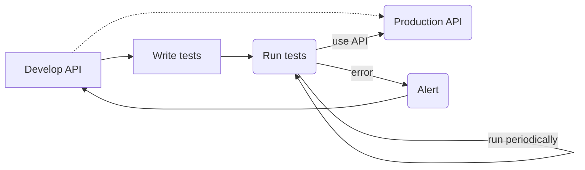
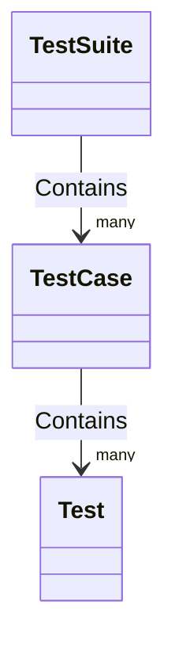

# chain-smoker
An easy-to-use testing framework for web interfaces.

## Quick example:
```yaml
type: 'api-test'
config:
  client:
    base_url: 'https://example.com'
tests:
  test_something:
    status_code: 200
    contains:
      This domain is for use in illustrative examples in documents.
      You may use this domain in literature without prior coordination or asking for permission.
```
or look into `examples/`
```shell
./chain-smoker.py -d examples
```

## Introduction
It's an issue for me, my friends and my colleagues at work or university.
We write code we test initially, but over time we forget about specific business logic
or functionality that lies in our API endpoints.
For this I started to build `chain-smoker`, a testing tool, with a functionality similar to https://uptimerobot.com.
You build your API, set up the tests, publish it and get notified whenever something breaks.

But how to use it and how to automate the tests?

## Using `chain-smoker`

First, clone the repository
```shell
git clone git@https://github.com/philsupertramp/chain-smoker.git
```
Now, you can decide to either use the provided `Dockerfile` and use the tool using `docker`, or you use the raw Python implementation.

### Python
Set up a local virtual environment
```shell
virtualenv .venv
source .venv/bin/activate

pip install --upgrade pip
pip install -r requirements.txt
```
To verify your set-up is working correctly, run
```shell
> bar=baz ./chain-smoker.py -d examples
[2022-09-14 13:37:32,554] INFO - Running for examples/complex-yaml.yaml:
[2022-09-14 13:37:38,292] INFO - Success for test_something!
[2022-09-14 13:37:38,302] INFO - Running for examples/multi_step_example.yaml:
[2022-09-14 13:37:38,302] INFO - Running chained test case reuse_authentication_header_in_following_request:
[2022-09-14 13:37:38,951] INFO - Success for get-with-header!
[2022-09-14 13:37:39,069] INFO - Success for second-get-with-header!
[2022-09-14 13:37:39,776] INFO - Success for get-without-header!
[2022-09-14 13:37:39,777] INFO - Running chained test case uses_keyword_example:
[2022-09-14 13:37:40,013] INFO - Success for create_user!
[2022-09-14 13:37:40,135] INFO - Success for update_username!
[2022-09-14 13:37:40,139] INFO - Running for examples/example_com.yaml:
[2022-09-14 13:37:40,901] INFO - Success for test_something!
[2022-09-14 13:37:40,923] INFO - Running for examples/simple_example.yaml:
[2022-09-14 13:37:41,608] INFO - Success for get!
[2022-09-14 13:37:41,723] INFO - Success for get-with-cookie!
[2022-09-14 13:37:42,064] INFO - Success for post!
[2022-09-14 13:37:42,186] INFO - Success for post-list-of-ids!
[2022-09-14 13:37:42,304] INFO - Success for post-list-of-objects!
[2022-09-14 13:37:42,420] INFO - Success for patch!
[2022-09-14 13:37:42,539] INFO - Success for put!
```
### Docker
To use the docker build, first build the container
```shell
docker build -t chain-smoker .
```
Then run the container with your test directory mounted into `/usr/src/app/smoke_tests`
```shell
docker run -v $(pwd)/examples:/usr/src/app/smoke_tests -e bar=baz chain-smoker
```

## Writing tests
After understanding what `chain-smoker` can be used for and how it can be used, we can focus on writing different kind of
tests.
In `chain-smoker` the structure is as following


whereas the `TestSuite` is the folder provided to `chain-smoker`, e.g. `./examples`.
A `TestCase` in this example might be `./examples/simple_example.yaml` or `./examples/example_com.yaml`.
And a `Test` might be a test inside one of these `TestCase` configurations, e.g. `test_something`  inside `./example/example_com.yaml`
```yaml
type: 'api-test'
config:
  client:
    base_url: 'https://example.com'
tests:
  test_something:  # <- this is a Test
    status_code: 200
    contains:
      This domain is for use in illustrative examples in documents.
      You may use this domain in literature without prior coordination or asking for permission.
```

So after all it comes down to organizing and writing `YAML` files, that follow a specific syntax.

### Syntax
Required for each `TestCase` configuration file are the three keys.

```yaml
type: String
```
**Note: currently, only `type: 'api-test'` is implemented and available.**
```yaml
config:
  client:
    base_url: String
    auth_header:
      Authorization: String
```
`config` is used to provide `TestCase` dependent configuration for the `base_url` used making requests and an
authorization header `auth_header` that is used in all `Test`s having `requires_auth=True`.
```yaml
tests:
  test_name:
    name: String  # verbose name of test, could be "test_name"
    endpoint: String  # the endpoint of config.client.base_url used in this test [default: '/']
    method: String  # method used in this test [default: 'get']
    payload: String  # a payload used in this test
    payload_cookies:  #
      - key: foo
        value: bar
        max_age: 5m
    multi_step: bool  # indicates that this is a chained test [default: False]
    is_authentication: bool  # indicates authentication step [default: False]
    requires_auth: bool  # indicates if test requires authentication [default: True]
    status_code: Integer  # expected status_code in response
    expects: String|Dict  # the test expects this response content
    expects_not: String|Dict  # the test expects everything but this in the response
    contains: String|Dict  # test if response content contains this
    contains_not: String|Dict  # test if response content doesn't contain this
    response_cookies: # list of cookies expected to receive as a response
      - key: String
        value: String
        domain: URL
        max_age: 5m # datetime with timezone or {N}{T} with N any int and T a time unit [m|d|W|M]
    uses:  # key value pairs of variables, used in this test
      variable_name: String  # evaluable python code to get the variable "variable_name"
    auth_header_template:
      token_position: String  # evaluable python code to get the variable "token", e.g. "res.json().get('data').get('token')"
      auth_header:
        Authorization: String  # a template string, e.g. 'JWT {token}' or just '{token}'
    steps: List[Test]  # chained test configurations, required if multi_step=True
```
As you can see by now the API is quite complex and feature rich, but there are many things to improve and add.

`chain-smoker` is powered using `pydantic`, to make use of its validation system.
Whenever you try to execute your configured test suite the configuration will be evaluated, so don't worry to forget something, `chain-smoker` will let you know.
